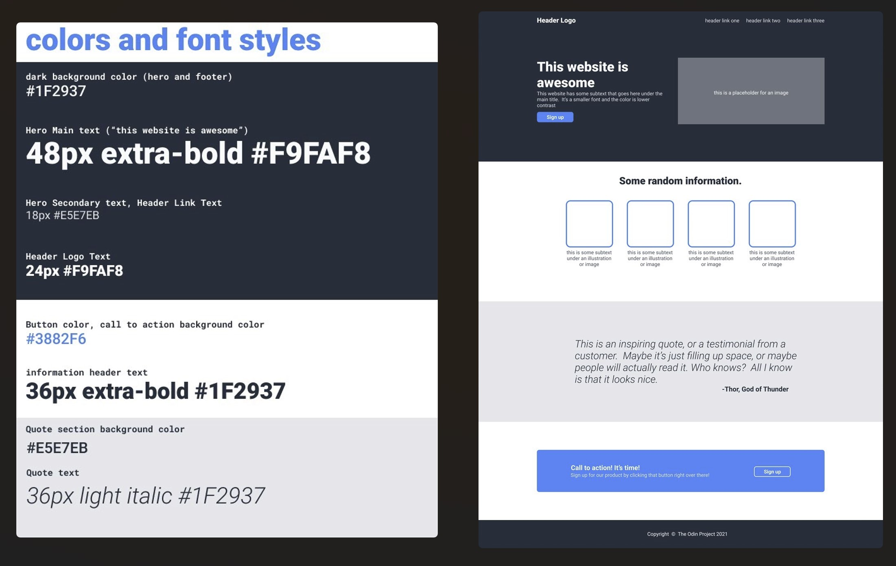
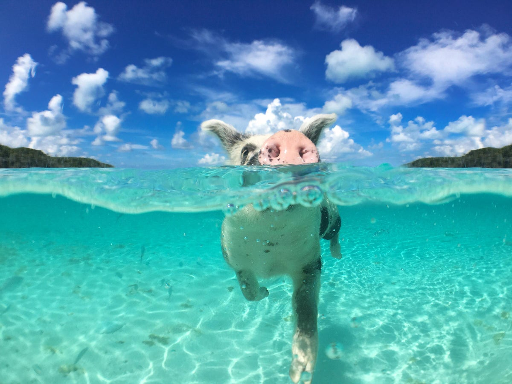

# Odin Landing Page

## Description

Mission: Create a landing page from scratch based on provided design specs (pictured above). To leave the CSS boxing ring victorious, a lot of nested flexbox-ing went into the creation of the final template. Pull no punches. Flexbox, FTW. 💪🥊

For extra credit, to demonstrate the template's customizeability, I personalized it by substituting all the dummy text and placeholder images with actual content . (Do you see what I see...? I spy with my dev tools...mobile and tablet responsiveness! 😉) 

Boys and girls, I present to you my template, post makeover: Pig Beach 🐽. Have you been dreaming of white sand beaches? Well, paradise is just a `<button>` click (or two) away. (Yes, I stole...err..._borrowed_ the lyrics from _Home on the Range_ for the hero text.)

👩‍💻 **TECH STACK: HTML, CSS**

---

### **Root Directory**
The _odin-landing-page_ folder contains the following:

1. _index.html_ - This is the landing page template, which is meant to be a replica of the provided wireframe/specs. 
    + Note, clicking either of the two "Sign up" buttons will bring you to _pig_beach.html_. Since there is no other JavaScript in this project, I opted to use an `onclick` event attribute within the `<button>` tag to accomplish this. (And since these are dummy buttons that do not link to an actual form, I just linked them to _pig_beach.html_ for the sake of linking to something.)
1. _pig_beach.html_ - an example of a customized template (based on _index.html_)
1. _styles.css_ - This stylesheet is used for the general layout of both _index.html_ and _pig_beach.html_.
    + _pig_beach.html_ has some additional styles declared internally within `<style>` tags at the top of the _.html_ file. Since this version of the landing page contains images--whereas the template does not--additional image-related CSS was required to properly style the page.
1. _odin-landing-page-specs.jpg_ (pictured above) - This is an image of the provided design specs.
1. this README.md file
1. an _images_ subdirectory - 5 files

---

### **_Images_ Folder**

This folder contains the five _.jpg_ files used in _pig_beach.html_. (I do not own the rights to any of these images.)

+ _pig-hero-img.jpg_ (pictured above) - This hero image is from [Key Caribe](https://magazine.keycaribe.com/experience/the-swimming-pigs-of-the-bahamas-where-did-they-come-from/).

The rest of the images (used for the "Highlights" section of the page) are from [The Daily Beast](https://www.thedailybeast.com/the-secret-of-pig-island/12?ref=scroll  ). 
+ _pig-celebrities.jpg_ - [image link](https://img.thedailybeast.com/image/upload/d_placeholder_euli9k/dpr_2.5/c_limit,h_636/fl_lossy,q_auto/v1530579967/04_GettyImages-187975040_uegvsg)
+ _island-local.jpg_ - [image link](https://img.thedailybeast.com/image/upload/d_placeholder_euli9k/dpr_2.5/c_limit,h_636/fl_lossy,q_auto/v1530579999/08_GettyImages-882553704_kcrqyf)
+ _feed-pigs.jpg_ - [image link](https://img.thedailybeast.com/image/upload/d_placeholder_euli9k/dpr_2.5/c_limit,h_636/fl_lossy,q_auto/v1530579983/12_GettyImages-846514438_k5wyvz)
+ _swimming-pig.jpg_ - [image link](https://img.thedailybeast.com/image/upload/d_placeholder_euli9k/dpr_2.5/c_limit,h_636/fl_lossy,q_auto/v1530580000/13_GettyImages-590072227_vojute)

