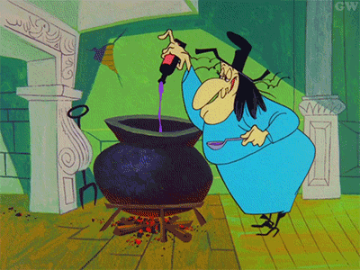

# Odin Recipes

## Description

A list-acular recipe website of ghastly delectables--`<ul>`'s! `<ol>`'s! and `<li>`'s! Oh, my!--with a splash of ✨ CSS flexbox ✨ thrown in for good measure. And a few zero-calorie media queries for mobile responsiveness.

P.S. The homepage is on fire 🔥😲. (If you can't handle the heat 🥵, get out of the kitchen.)

👩‍💻 **TECH STACK: HTML, CSS**

---

### **Root Directory**

The _odin-recipes_ folder contains the following:

1. _index.html_ - this is the homepage
1. _styles.css_ - this is the stylesheet for _index.html_
1. _recipes.css_ - this is the stylesheet for the three recipe pages
1. 2 subdirectories:
    + _assets_
    + _recipes_
1. this _README.md_ file

---

### **_Assets_ Folder**

This folder contains seven media files:

1. _witch.gif_ (from [GIPHY](https://giphy.com/gifs/halloween-witch-hazel-6Z3yLZzfZ0Kpa))

1. _monster32.png_ (by [Smashicons](https://www.flaticon.com/free-icon/silly_2776863) from [Flaticon](www.flaticon.com))

1. _monster128.png_ (by [Smashicons](https://www.flaticon.com/free-icon/silly_2776863) from [Flaticon](www.flaticon.com))

1. _fire.mp4_ video background (by [Nithin PA](https://www.pexels.com/video/a-burning-flame-emitting-black-smoke-3769241/) from [Pexels](https://www.pexels.com/))

1. _scarysgetti.jpg_ (from [Mouth of Mums](https://mouthsofmums.com.au/wp-content/uploads/2018/10/23/scary-sgetti.jpg))
1. _frankentoast.jpg_ (from [Brit + Co](https://www.brit.co/media-library/halloween-avocado-toast-faces.jpg?id=21474791&width=1428&quality=80))
1. _wicked-witch-of-the-whip.jpg_ (from [Fork and Beans](https://46j6bj2j51papmb0q1wvc8as-wpengine.netdna-ssl.com/wp-content/uploads/2015/10/Make-this-Halloween-fun-AND-healthy-with-a-Witchy-Guacamole-Dip-768x1078.jpg))

---

### **_Recipes_ Folder**

This folder contains the three recipe pages:

1. _scarysgetti.html_
1. _frankentoast.html_
1. _wicked-witch-of-the-whip.html_
